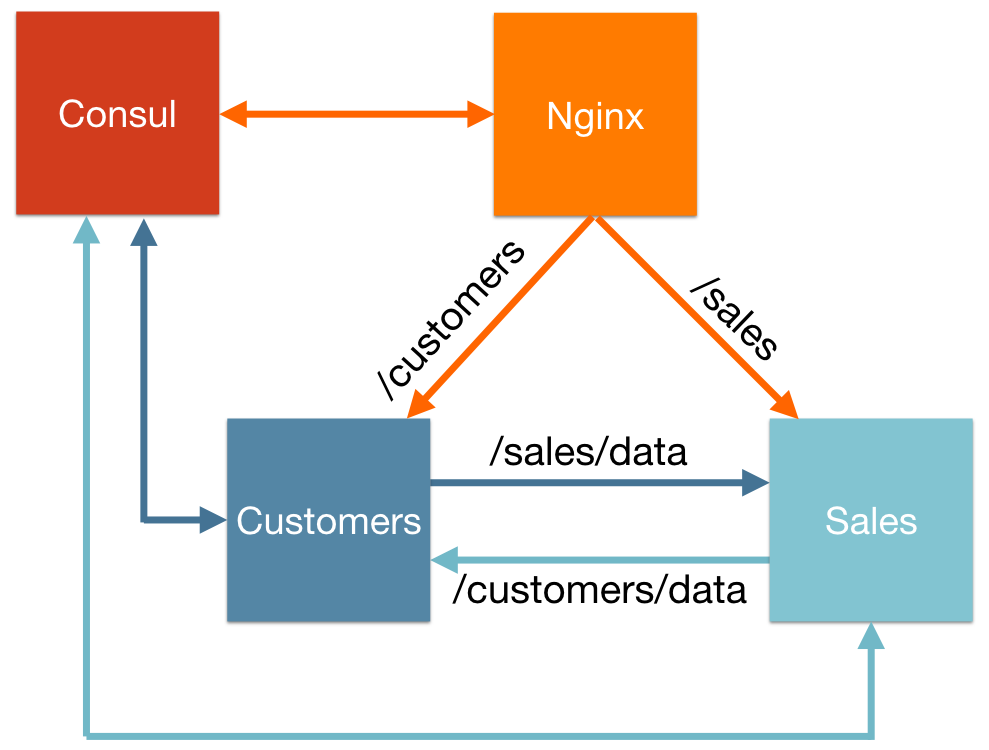

Applications on Autopilot
==========

*A demonstration of the autopilot pattern for self-operating microservices, designed as a workshop or tutorial.*

Microservices and [Docker](https://www.docker.com) go together like chocolate and peanut butter: microservice architectures provide organizations a tool to manage complexity of the development process, and application containers provide a new means to manage the dependencies and deployment of those microservices. But deploying and connecting those services together is still a challenge because it forces developers to design for operationalization.

The [Autopilot Pattern](http://autopilotpattern.io/) is a powerful design pattern to solving this problem. By pushing the responsibility for understanding startup, shutdown, scaling, and recovery from failure into the application, we can build intelligent architectures that minimize human intervention in operation. But we can't rewrite all our applications at once, so we need a way to build application containers that can knit together legacy and greenfield applications alike.

This project demonstrates this design pattern by applying it to a simple microservices deployment using Nginx and two Node applications.

### Getting started

This project requires a Docker host and client, as well as Docker Compose. The latest version of [Docker](https://www.docker.com) will provide a suitable environment for users on OS X or Windows.

### Project architecture

The project is broken into 4 subsystems. Web clients communicate only with Nginx, which serves as a reverse proxy and load balancer to two microservices -- Customers and Sales. The microservices should be able to be scaled to arbitrary numbers of nodes and the virtualhost configuration in Nginx will be updated to suit. Also, the Customers application needs data from Sales and the Sales application needs data from Customers. This means that when we scale up Sales nodes, all the Customer nodes must learn of the change (and vice-versa). We use Joyent's [ContainerPilot](https://github.com/joyent/containerpilot) to orchestrate this process and Hashicorp's [Consul](https://www.consul.io/) as a discovery service.

The [`start`](https://github.com/autopilotpattern/workshop/tree/start) branch of this repo containrs only an incomplete skeleton of services as a starting point. The configuration for Nginx and the Sales microservice are left incomplete, whereas the Customer microservice is complete and already includes the ContainerPilot configuration. You can find an up-to-date version of the complete application on the [`master`] branch.

[Releases](https://github.com/autopilotpattern/workshop/releases) will include the completed application as demonstrated at various workshops:

- [ContainerSummit NYC 2016](https://github.com/autopilotpattern/workshop/releases/tag/containersummit-nyc2016)
- [Container.Camp SF 2016](https://github.com/autopilotpattern/workshop/releases/tag/containercamp-sf2016)
